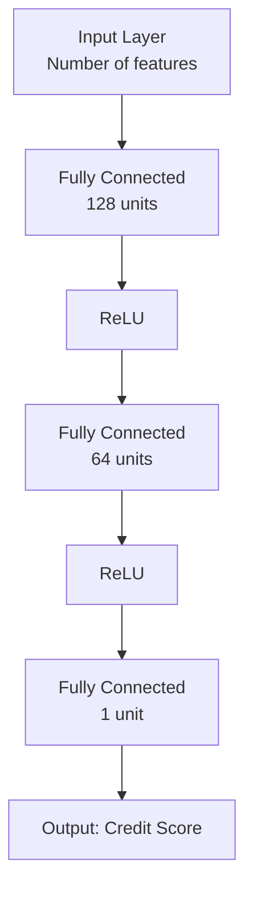
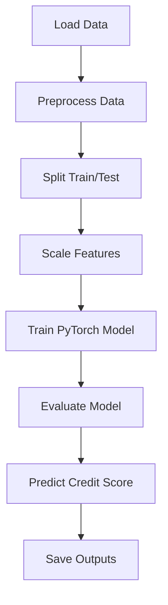

# Credit Score Prediction using Regression

This project focuses on building a machine learning regression model to predict a person's **credit score** based on their demographic and financial attributes using a neural network implemented in PyTorch.

---

## 📊 Problem Statement

Given a dataset containing financial and personal data such as income, age, number of dependents, and more, the objective is to accurately predict the **credit score** of an individual.

---

## 🧠 Methodology

- **Preprocessing**: Features are scaled using `MinMaxScaler` for better convergence of the neural network.
- **Model**: A fully connected feed-forward neural network with ReLU activations and MSELoss.
- **Training**: The model is trained using Adam optimizer on the scaled dataset.
- **Evaluation**: Performance is measured using Mean Squared Error (MSE) on the test set.

---

## 🏗️ Architecture

The model architecture is visualized below as a flowchart:



---

## 🔄 Processing Flow



## Score Logic

* Aggregate behavioral features like repay_ratio, borrow_deposit_ratio, liquidations, etc., from raw transaction data per wallet.

* Scale features using StandardScaler to normalize the input distribution before feeding into the neural network.

* Predict a raw score using a trained regression-based neural network (WalletNet) that outputs a single continuous value in the scaled space.

* Inverse transform the predicted score using the target scaler (scaler_y) to convert it back into the original scale of credit scores.

* Clip the final score to ensure it lies within a realistic credit range (typically [300, 850]) using:
* score = max(300, min(850, round(score)))

* Log the raw output and corresponding address for debugging, explainability, and transparency.

* Store final results in a structured output.json for further analysis or system integration.

---

## 🧪 Evaluation Results

The following results are based on the evaluation done on the test data:

| Metric           | Value    |
|------------------|----------|
| Training MSE     | 0.000782 |
| Testing MSE      | 0.000874 |

Sample Predictions:

| True Credit Score | Predicted Credit Score |
|-------------------|------------------------|
| 600.00            | 599.32                 |
| 600.00            | 599.32                 |
| 600.00            | 599.32                 |
| 600.00            | 595.41                 |
| 750.00            | 730.57                 |

---

## 📁 Project Structure

```
Zeru/
│
├── model.pth                # Trained PyTorch model
├── scaler_x.pkl             # Scaler used for input features
├── scaler_y.pkl             # Scaler used for target variable
├── output.json              # Predicted vs True scores
├── input.json               # Grouped wallet transaction data
├── readme.md                # Readme file
├── credit_score_model.ipynb # Main notebook
├── analysis.md              # Markdown file containing evaluation
```
