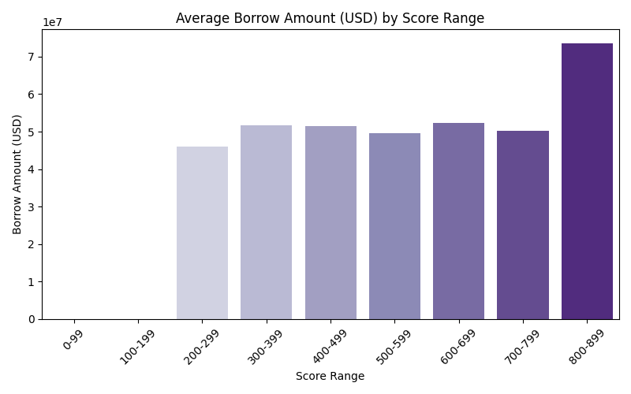

# 📊 Wallet Score Analysis

## 📈 Score Distribution

## 💡 Behavior Summary by Score Range

### 🔻 Low Score Wallets (0–200)
- Average Transactions: 18.69
- Average Borrow Amount (USD): 79256391943307130830848.00
- Average Repay Ratio: 0.81
- Average Liquidations: 0.00

### 🔺 High Score Wallets (700–850)
- Average Transactions: 72.67
- Average Borrow Amount (USD): 61357227223408946708480.00
- Average Repay Ratio: 0.28
- Average Liquidations: 2.97

## 📌 Observations
- High-score wallets tend to have **higher repay ratios**, **lower liquidation events**, and **stable borrowing patterns**.
- Low-score wallets often have **high liquidation counts**, **low or unstable repayments**, and possibly **aggressive borrowing**.

## 📊 Visual Analysis
Below are visualizations summarizing the credit score distribution and behavior across score ranges:

### 🔹 Credit Score Distribution

### 🔹 Average Repay Ratio by Score Range

### 🔹 Average Liquidations by Score Range

### 🔹 Average Borrow Amount by Score Range

These graphs help highlight how behaviors like repayment and borrowing impact wallet credit scores.
